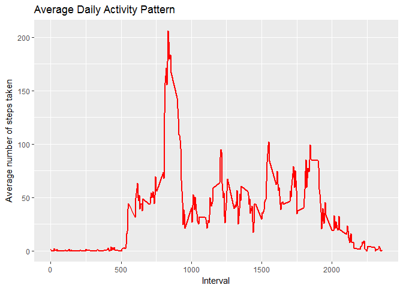
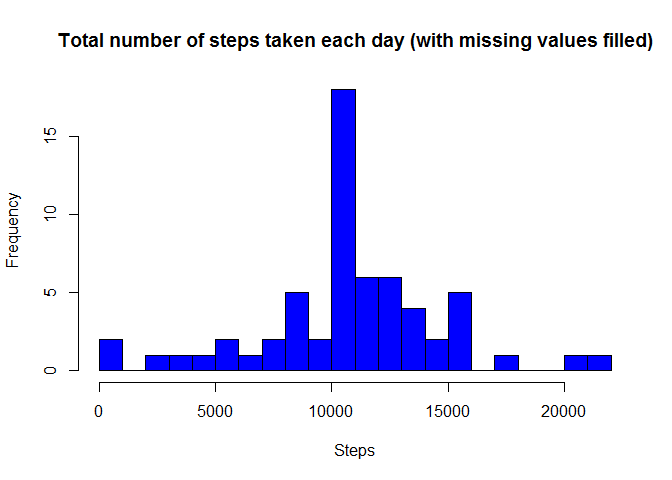

# Reproducible Research: Peer Assessment 1


```r
library(ggplot2)
library(lattice)
```

## Loading and preprocessing the data

##### A1. Loading the data

```r
if(!file.exists('activity.csv')){
    unzip('activity.zip')
}
actData <- read.csv('activity.csv')
```

##### A2. Preprocessing the data

```r
#Decided not to preprocess the data, keep this original set and proceed next
```

## What is mean total number of steps taken per day?

##### B1. Group the steps by date and show the data

```r
steps_per_day <- aggregate(steps ~ date, actData, sum)
colnames(steps_per_day) <- c("date","steps")
steps_per_day
```

```
##          date steps
## 1  2012-10-02   126
## 2  2012-10-03 11352
## 3  2012-10-04 12116
## 4  2012-10-05 13294
## 5  2012-10-06 15420
## 6  2012-10-07 11015
## 7  2012-10-09 12811
## 8  2012-10-10  9900
## 9  2012-10-11 10304
## 10 2012-10-12 17382
## 11 2012-10-13 12426
## 12 2012-10-14 15098
## 13 2012-10-15 10139
## 14 2012-10-16 15084
## 15 2012-10-17 13452
## 16 2012-10-18 10056
## 17 2012-10-19 11829
## 18 2012-10-20 10395
## 19 2012-10-21  8821
## 20 2012-10-22 13460
## 21 2012-10-23  8918
## 22 2012-10-24  8355
## 23 2012-10-25  2492
## 24 2012-10-26  6778
## 25 2012-10-27 10119
## 26 2012-10-28 11458
## 27 2012-10-29  5018
## 28 2012-10-30  9819
## 29 2012-10-31 15414
## 30 2012-11-02 10600
## 31 2012-11-03 10571
## 32 2012-11-05 10439
## 33 2012-11-06  8334
## 34 2012-11-07 12883
## 35 2012-11-08  3219
## 36 2012-11-11 12608
## 37 2012-11-12 10765
## 38 2012-11-13  7336
## 39 2012-11-15    41
## 40 2012-11-16  5441
## 41 2012-11-17 14339
## 42 2012-11-18 15110
## 43 2012-11-19  8841
## 44 2012-11-20  4472
## 45 2012-11-21 12787
## 46 2012-11-22 20427
## 47 2012-11-23 21194
## 48 2012-11-24 14478
## 49 2012-11-25 11834
## 50 2012-11-26 11162
## 51 2012-11-27 13646
## 52 2012-11-28 10183
## 53 2012-11-29  7047
```

##### B2. Generate histogram

```r
hist(steps_per_day$steps, main="Total number of steps taken per day", xlab="Steps",breaks=16,col="blue")
```

<!-- -->

##### B3. Show the mean of the total number of steps taken per day

```r
mean_steps_day <- mean(steps_per_day$steps)
mean_steps_day
```

```
## [1] 10766.19
```
and, show the median of the total number of steps taken per day

```r
median_steps_day <- median(steps_per_day$steps)
median_steps_day
```

```
## [1] 10765
```

## What is the average daily activity pattern?

##### C1. Plot about average number of steps taken compare interval 

```r
average_steps_interval <- aggregate(steps ~ interval, actData, mean)

ggplot(average_steps_interval, aes(x=interval,y=steps)) +
 geom_line(color="red",size=1) +
 labs(title="Average Daily Activity Pattern", x="Interval", y="Average number of steps taken")
```

<!-- -->

##### C2. Show the 5-mins interval which contains the maximum number of steps

```r
#get the interval column
max_steps_5min_interval <- average_steps_interval[which.max(average_steps_interval$steps),1] 

#convert to interval format
max_steps_time_format <-  gsub("([0-9]{1,2})([0-9]{2})", "\\1:\\2", max_steps_5min_interval) 
```
* The maximum number of steps happened at **8:35** interval


## Imputing missing values

##### D1. Show the total number of missing values

```r
total_NA <- sum(is.na(actData$steps))
```
* The total number of missing values is **2304**

##### D2. Filling in all the missing values

```r
#plan to fill the missing values with mean value for the 5-min interval
avg_5min_inteval <- tapply(actData$steps,actData$interval, mean, na.rm=TRUE, simplify=TRUE)

#store the row that with missing values
NAS_set <- is.na(actData$steps)
```

##### D3. Create new dataset that derived from original dataset but with filled missing values

```r
#create new dataset
actData_new <- actData

#filled new dataset missing values (NAS) with average values for 5-minute interval
actData_new$steps[NAS_set] <- avg_5min_inteval[as.character(actData_new$interval[NAS_set])]
```

##### D4. Generate histogram for new dataset with missing data filled in

```r
steps_per_day_new <- aggregate(steps ~ date, actData_new, sum)

hist(steps_per_day_new$steps, main="Total number of steps taken each day (with missing values filled)", xlab="Steps",breaks=16,col="blue")
```

<!-- -->

- Show the mean of the total number of steps taken per day. (newset) 

```r
mean_steps_day_new <- mean(steps_per_day_new$steps)
mean_steps_day_new
```

```
## [1] 10766.19
```

- Show the median of the total number of steps taken per day. (newset) 

```r
median_steps_day_new <- median(steps_per_day_new$steps)
median_steps_day_new
```

```
## [1] 10766.19
```
The values comparing with the first part is the same for mean, since the imputed missing values were mean. And having slightly different in the median comparing to the first part.


## Are there differences in activity patterns between weekdays and weekends?

##### E1. Create a new factor variable with two levels "weekday" and "weekend"

```r
actData_new$daytype <- factor(weekdays(as.Date(actData_new$date))) 

#rename weekdays to factor naming 'weekday' or 'weekend'
levels(actData_new$daytype) <- list (
weekday=c("Monday","Tuesday","Wednesday","Thursday","Friday"),
weekend=c("Saturday","Sunday") 
) 
```

##### E2. Panel plot comparing the average number of steps taken per 5-minute interval across weekdays and weekends

```r
avg_steps_daytype <- aggregate(steps ~ daytype + interval, actData_new, mean)

xyplot(steps ~ interval | daytype, data = avg_steps_daytype, type="l", layout = c(1,2), xlab="Interval", ylab=
         "Number of steps")
```

<!-- -->


